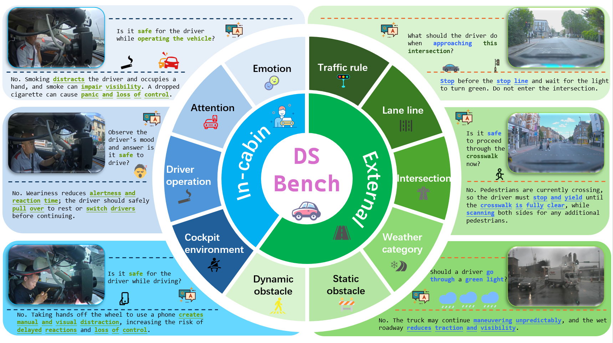
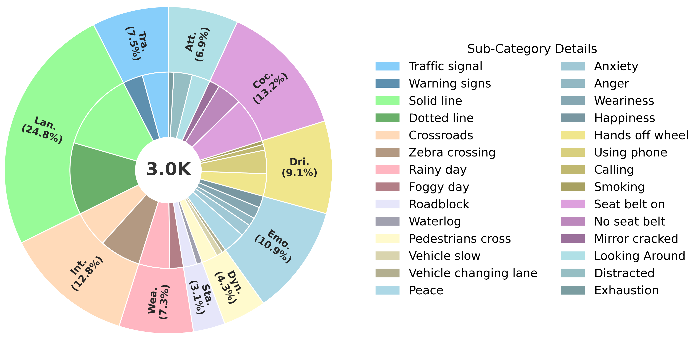

<h1 align="center">
Is Your VLM for Autonomous Driving Safety-Ready? 
A Comprehensive Benchmark for Evaluating External and In-Cabin Risks
</h1>

<p align='center'>
 </img>
</p>


 
Vision-Language Models (VLMs) hold potential for autonomous driving, but their suitability for safety-critical scenarios remains largely unexplored. To address this, we introduce DSBench, the first comprehensive benchmark that evaluates both external environmental risks and in-cabin driving behaviors across 10 key categories and 28 subcategories. Our evaluations of existing VLMs show significant performance drops under complex scenarios, emphasizing the need for improvement. To tackle this, we developed a large dataset of 98K instances, demonstrating that fine-tuning with it enhances safety performance. Toolkit, code, and model checkpoints will be made publicly available.


# Overview
This is the official code implementation of DSBench [Paper](https://arxiv.org/abs/2511.14592). 
<div align="center">
 </img>
</div>

  

# Installation
```
conda create -n dsbench python=3.12 -y
conda activate dsbench
pip install torch torchvision torchaudio 
pip install openai transformers
```

# Benchmark
Our benchmark can be available at [here](https://pan.baidu.com/s/1taaHuE4yo_mEcd38yrGLHQ?pwd=3560). 

# DSVLM
Our checkpoint can be available at [here](https://huggingface.co/mengxxianhhui/DSVLM). 

# Inference
Our inference code can be found in the "inference" folder.

For commercial models run:
```
python inference/inference_close.py
``` 

For open source models run:
```
python inference/inference.py
``` 

If using a local deployment approach, run:
```
python inference/inference_close.py
``` 